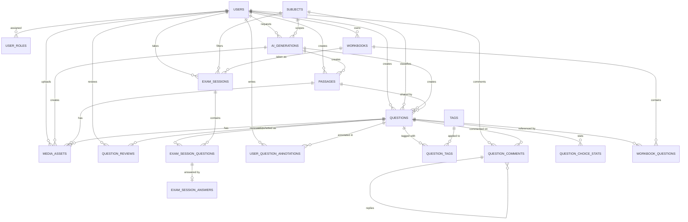

# Q-Idea / Exam Studio DB 스키마 설계서

> 기준 파일: `prisma/schema.prisma`
>
> 이 문서는 현재 MVP 리팩터링이 반영된 Prisma 스키마를 설명한다. 운영 스키마의 기준은 `prisma/schema.prisma`이며, 이 문서는 테이블 의도와 화면/기능 연결을 빠르게 이해하기 위한 보조 문서다.

## 1. 설계 원칙

* **단원 트리 대신 3단 분류의 세부 과목으로 직접 분류한다.** 현재 MVP에는 `units` 테이블이 없다. `subjects.exam_type`이 시험(예: 수능, 내신), `subjects.exam_category`가 대분류(예: 국어, 수학), `subjects.name`이 소분류(예: 문학, 독해)를 나타내고, `questions.subject_id`가 이를 직접 참조한다. (수능 국어 문학과 내신 국어 문학은 별개 행으로 관리)
* **문항 본문은 ProseMirror/Tiptap JSON으로 저장한다.** `questions.stem`, `questions.choices`, `questions.explanation`, `passages.content`는 모두 `Json` 컬럼이다. LLM은 평문만 만들고, 서버의 ProseMirror 유틸이 JSON 문서로 조립한다.
* **응시 시점의 문항은 스냅샷으로 고정한다.** `exam_session_questions.snapshot`에 출제 당시 문항 내용을 저장해, 이후 원본 문제가 수정되어도 이미 응시한 시험의 채점 기준은 바뀌지 않는다.
* **출제자는 문항별 풀이 힌트를 등록할 수 정할 수 있다.** `questions.hint_content`가 출제자 제공 힌트 원본이다. 시험 조립 시 스냅샷에도 함께 고정되어, 지난 풀이 세션과 오답노트에서 당시 힌트 내용을 재현할 수 있다.
* **힌트 열람 이력은 풀이 세션 단위로 추적한다.** 사용자가 풀이 중 힌트를 열면 `exam_session_questions.is_hint_used`와 `hint_used_at`에 기록한다. 오답노트는 틀린 답안의 `exam_session_question_id`를 따라가 지난 세션의 힌트 사용 여부, 최초 열람 시각, 스냅샷 힌트를 표시한다.
* **오답노트는 문항 주석과 오답 풀이 이력을 분리한다.** `user_question_annotations`는 드래그 기반 하이라이트/밑줄/메모를 저장하고, 오답 여부와 풀이 세션 정보는 `exam_session_answers` 및 `exam_session_questions`에서 가져온다.
* **비밀번호는 해시만 저장한다.** `users.password_hash`에는 bcrypt 해시를 저장하며 평문 비밀번호는 저장하지 않는다.
* **문제집(Pick & Mix) 기능을 통해 문항을 묶어 관리한다.** 사용자는 여러 소분류를 섞어 자신만의 문제집(`workbooks`)을 만들 수 있으며, 문항 복사가 아닌 참조(`workbook_questions.question_id`) 방식을 사용하여 원본 문항의 수정사항이 반영되도록 한다. 

## 2. ERD

## 3. Enum

### `UserRoleType`

| 값 | 설명 |
| --- | --- |
| CREATOR | 출제자 |
| CONSUMER | 소비자/수험생 |
| ADMIN | 관리자 |

### `GenerationStatus`

| 값 | 설명 |
| --- | --- |
| PENDING | 생성 대기/진행 중 |
| COMPLETED | 생성 완료 |
| FAILED | 생성 실패 |

### `PassageStatus`, `QuestionStatus`, `ExamSessionStatus`

| enum | 값 |
| --- | --- |
| PassageStatus | DRAFT, PUBLISHED, ARCHIVED |
| QuestionStatus | DRAFT, IN_REVIEW, PUBLISHED, ARCHIVED |
| ExamSessionStatus | IN_PROGRESS, SUBMITTED, EXPIRED |

### `MediaAssetType`

| 값 | 설명 |
| --- | --- |
| IMAGE | MVP에서는 이미지 업로드만 지원한다. `GRAPH_CODE`, `SVG`는 현재 Prisma 스키마에 없다. |

## 4. 테이블 정의

### 4.1 `users` - 사용자 (Prisma: `User`)

| DB 컬럼 | Prisma 필드 | 타입 | 설명 |
| --- | --- | --- | --- |
| id | id | CHAR(36) PK | UUID |
| email | email | VARCHAR(255), unique | 로그인 이메일 |
| password_hash | passwordHash | VARCHAR(255) | bcrypt 해시 |
| nickname | nickname | VARCHAR(100) | 표시 이름 |
| creator_bio | creatorBio | TEXT, nullable | 출제자 소개 |
| created_at | createdAt | DateTime | 생성 시각 |
| updated_at | updatedAt | DateTime | 수정 시각 |

### 4.2 `user_roles` - 사용자 권한 (Prisma: `UserRole`)

| DB 컬럼 | Prisma 필드 | 타입 | 설명 |
| --- | --- | --- | --- |
| user_id | userId | CHAR(36), PK/FK | `users.id`, 삭제 시 cascade |
| role | role | UserRoleType, PK | CREATOR, CONSUMER, ADMIN |

### 4.3 `subjects` - 3단 분류의 세부 과목 (Prisma: `Subject`)

| DB 컬럼 | Prisma 필드 | 타입 | 설명 |
| --- | --- | --- | --- |
| id | id | CHAR(36) PK | UUID |
| exam_type | examType | VARCHAR(50) | 시험 (수능, 내신 등). 기본값 "수능" |
| exam_category | examCategory | VARCHAR(50) | 대분류 (국어, 수학 등) |
| name | name | VARCHAR(100) | 소분류 (문학, 미적분 등) |
| sort_order | sortOrder | INT | 정렬 순서 |
| is_active | isActive | BOOLEAN | 사용 여부 |

인덱스: `(exam_type, exam_category, name)` (유니크), `(exam_type, exam_category, sort_order)`

### 4.4 `tags` - 문항 태그 (Prisma: `Tag`)

| DB 컬럼 | Prisma 필드 | 타입 | 설명 |
| --- | --- | --- | --- |
| id | id | CHAR(36) PK | UUID |
| name | name | VARCHAR(100) | 태그명 |
| category | category | VARCHAR(50) | 태그 분류 |

### 4.5 `ai_generations` - AI 생성 작업 (Prisma: `AiGeneration`)

| DB 컬럼 | Prisma 필드 | 타입 | 설명 |
| --- | --- | --- | --- |
| id | id | CHAR(36) PK | UUID |
| creator_id | creatorId | CHAR(36), FK | 요청자 |
| subject_id | subjectId | CHAR(36), FK | 생성 대상 세부 과목, NOT NULL |
| input_params | inputParams | JSON | 생성 요청 파라미터 스냅샷 |
| model | model | VARCHAR(100) | 사용 모델 |
| status | status | GenerationStatus | PENDING, COMPLETED, FAILED |
| created_at | createdAt | DateTime | 생성 시각 |

### 4.6 `passages` - 지문 (Prisma: `Passage`)

| DB 컬럼 | Prisma 필드 | 타입 | 설명 |
| --- | --- | --- | --- |
| id | id | CHAR(36) PK | UUID |
| creator_id | creatorId | CHAR(36), FK | 작성자 |
| generation_id | generationId | CHAR(36), nullable FK | AI 생성 작업 |
| content | content | JSON | ProseMirror/Tiptap 문서 |
| status | status | PassageStatus | DRAFT, PUBLISHED, ARCHIVED |
| created_at | createdAt | DateTime | 생성 시각 |
| updated_at | updatedAt | DateTime | 수정 시각 |

### 4.7 `questions` - 문제 (Prisma: `Question`)

| DB 컬럼 | Prisma 필드 | 타입 | 설명 |
| --- | --- | --- | --- |
| id | id | CHAR(36) PK | UUID |
| creator_id | creatorId | CHAR(36), FK | 출제자 |
| generation_id | generationId | CHAR(36), nullable FK | AI 생성 작업 |
| subject_id | subjectId | CHAR(36), FK | 세부 과목, NOT NULL |
| passage_id | passageId | CHAR(36), nullable FK | 연결 지문 |
| question_type | questionType | VARCHAR(20) | 앱단 상수 기준: 객관식/주관식 |
| stem | stem | JSON | 발문 리치 문서 |
| choices | choices | JSON, nullable | 객관식 보기 배열/문서 |
| explanation | explanation | JSON, nullable | 해설 리치 문서 |
| correct_answer_text | correctAnswerText | TEXT, nullable | 주관식 자동 채점용 정답. null이면 자기 채점 |
| difficulty | difficulty | TINYINT | 기본값 3 |
| points | points | DECIMAL(6,2) | 기본값 1.00 |
| status | status | QuestionStatus | DRAFT, IN_REVIEW, PUBLISHED, ARCHIVED |
| metadata | metadata | JSON, nullable | 출처, 연도 등 확장 메타데이터 |
| autosaved_at | autosavedAt | DateTime, nullable | 자동 저장 시각 |
| published_at | publishedAt | DateTime, nullable | 발행 시각 |
| search_text | searchText | TEXT, nullable | JSON 문서에서 추출한 검색용 평문 |
| hint_content | hintContent | TEXT, nullable | 출제자가 문제 편집/풀이 설계 단계에서 등록하는 풀이 힌트 |
| total_solved_count | totalSolvedCount | INT | 누적 풀이 수 캐시 |
| correct_solved_count | correctSolvedCount | INT | 누적 정답 수 캐시 |
| view_count | viewCount | INT | 누적 조회수 (인기순 정렬 최적화용) |
| total_time_spent_sec | totalTimeSpentSec | INT | 풀이시간 합계 (평균 계산용) |
| timed_solved_count | timedSolvedCount | INT | 시간 기록된 풀이 횟수 |
| created_at | createdAt | DateTime | 생성 시각 |
| updated_at | updatedAt | DateTime | 수정 시각 |

인덱스: `status`, `(subject_id, status)`, `total_solved_count`, `view_count`

힌트 표시 정책:

* 출제자가 입력한 `hint_content`는 원본 문항의 힌트다.
* 시험지를 조립할 때 `exam_session_questions.snapshot`에 당시 문항 내용과 함께 고정한다.
* 풀이 중 힌트를 열면 세션 문항의 `is_hint_used`, `hint_used_at`에 기록한다.
* 오답노트는 틀린 답안의 세션 문항을 기준으로 지난 풀이에서 힌트를 봤는지와 당시 힌트 내용을 표시한다.

### 4.8 `media_assets` - 이미지 미디어 (Prisma: `MediaAsset`)

| DB 컬럼 | Prisma 필드 | 타입 | 설명 |
| --- | --- | --- | --- |
| id | id | CHAR(36) PK | UUID |
| passage_id | passageId | CHAR(36), nullable FK | 연결 지문 |
| question_id | questionId | CHAR(36), nullable FK | 연결 문항 |
| generation_id | generationId | CHAR(36), nullable FK | AI 생성 작업 |
| uploader_id | uploaderId | CHAR(36), FK | 업로더 |
| asset_type | assetType | MediaAssetType | 현재 IMAGE만 지원 |
| storage_url | storageUrl | VARCHAR(500) | Supabase Storage public URL |
| width_px | widthPx | INT, nullable | 이미지 너비 |
| height_px | heightPx | INT, nullable | 이미지 높이 |
| created_at | createdAt | DateTime | 생성 시각 |

### 4.9 `question_tags` - 문제/태그 매핑 (Prisma: `QuestionTag`)

| DB 컬럼 | Prisma 필드 | 타입 | 설명 |
| --- | --- | --- | --- |
| question_id | questionId | CHAR(36), PK/FK | 문제 |
| tag_id | tagId | CHAR(36), PK/FK | 태그 |

### 4.10 `exam_sessions` - 모의고사 풀이 세션 (Prisma: `ExamSession`)

| DB 컬럼 | Prisma 필드 | 타입 | 설명 |
| --- | --- | --- | --- |
| id | id | CHAR(36) PK | UUID |
| user_id | userId | CHAR(36), FK | 응시자 |
| subject_id | subjectId | CHAR(36), nullable FK | 세부 과목 (문제집 통째 응시 시 null 가능) |
| workbook_id | workbookId | CHAR(36), nullable FK | 문제집 통째 응시 출처 |
| filter_criteria | filterCriteria | JSON | 수동 선택 또는 필터 조건 스냅샷 |
| status | status | ExamSessionStatus | IN_PROGRESS, SUBMITTED, EXPIRED |
| started_at | startedAt | DateTime, nullable | 시작 시각 |
| submitted_at | submittedAt | DateTime, nullable | 제출 시각 |
| duration_sec | durationSec | INT, nullable | 제한/풀이 시간 |

인덱스: `(workbook_id, status)`

### 4.11 `exam_session_questions` - 세션별 문항 스냅샷 (Prisma: `ExamSessionQuestion`)

| DB 컬럼 | Prisma 필드 | 타입 | 설명 |
| --- | --- | --- | --- |
| id | id | CHAR(36) PK | UUID |
| exam_session_id | examSessionId | CHAR(36), FK | 풀이 세션 |
| question_id | questionId | CHAR(36), FK | 원본 문제 |
| display_order | displayOrder | INT | 세션 내 노출 순서 |
| snapshot | snapshot | JSON | 출제 당시 문항 전체 스냅샷 |
| is_hint_used | isHintUsed | BOOLEAN | 해당 풀이에서 힌트를 열람했는지 여부, 기본값 false |
| hint_used_at | hintUsedAt | DateTime, nullable | 힌트를 최초로 연 시각 |

인덱스: `question_id`, `exam_session_id`

오답노트 표시 흐름:

* `exam_session_answers.is_correct = false`인 답안을 찾는다.
* 해당 답안의 `exam_session_question_id`로 `exam_session_questions`를 조인한다.
* 오답노트 카드에는 세션 문항의 `is_hint_used`, `hint_used_at`, `snapshot` 안의 힌트 정보를 함께 표시한다.
* 같은 문제를 여러 번 틀린 경우, 각 과거 풀이 세션의 힌트 사용 기록을 별도로 보여줄 수 있다.

### 4.12 `exam_session_answers` - 답안 및 채점 결과 (Prisma: `ExamSessionAnswer`)

| DB 컬럼 | Prisma 필드 | 타입 | 설명 |
| --- | --- | --- | --- |
| id | id | CHAR(36) PK | UUID |
| exam_session_question_id | examSessionQuestionId | CHAR(36), unique FK | 세션 문항 |
| selected_choice_ids | selectedChoiceIds | JSON, nullable | 객관식 선택값 |
| answer_text | answerText | TEXT, nullable | 주관식 답안 |
| is_correct | isCorrect | BOOLEAN, nullable | 자동 채점 결과 또는 자기 채점 전 null |
| annotations | annotations | JSON, nullable | 답안 부가 표시/메모용 확장 JSON |
| time_spent_sec | timeSpentSec | INT, nullable | 풀이 소요 시간 |
| answered_at | answeredAt | DateTime, nullable | 답안 제출 시각 |

### 4.13 `question_reviews` - 리뷰와 체감 난이도 (Prisma: `QuestionReview`)

| DB 컬럼 | Prisma 필드 | 타입 | 설명 |
| --- | --- | --- | --- |
| id | id | CHAR(36) PK | UUID |
| question_id | questionId | CHAR(36), FK | 리뷰 대상 문제 |
| reviewer_id | reviewerId | CHAR(36), FK | 리뷰 작성자 |
| rating | rating | TINYINT | 문제 품질/추천 별점, 1~5 |
| perceived_difficulty | perceivedDifficulty | TINYINT, nullable | 수험생 체감 난이도, 1~5 |
| review_text | reviewText | TEXT, nullable | 리뷰 내용 |
| created_at | createdAt | DateTime | 작성 시각 |
| updated_at | updatedAt | DateTime | 수정 시각 |

제약: `(question_id, reviewer_id)` unique

### 4.14 `question_comments` - 문제 Q&A 댓글 (Prisma: `QuestionComment`)

| DB 컬럼 | Prisma 필드 | 타입 | 설명 |
| --- | --- | --- | --- |
| id | id | CHAR(36) PK | UUID |
| question_id | questionId | CHAR(36), FK | 대상 문제 |
| author_id | authorId | CHAR(36), FK | 작성자 |
| parent_comment_id | parentCommentId | CHAR(36), nullable FK | 부모 댓글 |
| content | content | TEXT | 댓글 내용 |
| created_at | createdAt | DateTime | 작성 시각 |
| updated_at | updatedAt | DateTime | 수정 시각 |

인덱스: `(question_id, created_at)`

### 4.15 `user_question_annotations` - 오답노트 2.0 주석 (Prisma: `UserQuestionAnnotation`)

| DB 컬럼 | Prisma 필드 | 타입 | 설명 |
| --- | --- | --- | --- |
| id | id | CHAR(36) PK | UUID |
| user_id | userId | CHAR(36), FK | 작성자 |
| question_id | questionId | CHAR(36), FK | 대상 문제 |
| target | target | VARCHAR(20) | GENERAL, PASSAGE, STEM, CHOICES, EXPLANATION |
| target_id | targetId | VARCHAR(36), nullable | 지문/보기 등 세부 앵커 ID |
| mark_style | markStyle | VARCHAR(20) | HIGHLIGHT, UNDERLINE |
| color | color | VARCHAR(20) | 표시 색상, 기본 yellow |
| selected_text | selectedText | TEXT, nullable | 선택한 원문 문자열 |
| selection_range | selectionRange | JSON, nullable | 에디터 오프셋/앵커 정보 |
| reason_code | reasonCode | VARCHAR(20), nullable | CONCEPT, MISTAKE, TIME, OTHER 등 오답 원인 |
| memo_text | memoText | TEXT, nullable | 개인 메모 |
| created_at | createdAt | DateTime | 작성 시각 |
| updated_at | updatedAt | DateTime | 수정 시각 |

인덱스: `(user_id, question_id)`, `(user_id, updated_at)`, `(user_id, reason_code)`

### 4.16 `question_choice_stats` - 선지별 선택 횟수 (Prisma: `QuestionChoiceStat`)

| DB 컬럼 | Prisma 필드 | 타입 | 설명 |
| --- | --- | --- | --- |
| question_id | questionId | CHAR(36), PK/FK | 대상 문제 |
| choice_id | choiceId | VARCHAR(36), PK | 문항 내 선지 로컬 문자열 (예: "c1") |
| count | count | INT | 누적 선택 횟수 |

* 출제자가 선지를 교체/재배열할 경우 기존 카운트를 초기화(삭제)한다.
* 오답 분포 차트를 위해 제출 시점에 갱신한다.

### 4.17 `workbooks` - 문제집 (Prisma: `Workbook`)

| DB 컬럼 | Prisma 필드 | 타입 | 설명 |
| --- | --- | --- | --- |
| id | id | CHAR(36) PK | UUID |
| owner_id | ownerId | CHAR(36), FK | 소유자 |
| title | title | VARCHAR(200) | 제목 |
| description | description | TEXT, nullable | 설명 |
| cover_image_url | coverImageUrl | VARCHAR(500), nullable | 표지 이미지 URL |
| visibility | visibility | VARCHAR(20) | PUBLIC, PRIVATE 등 |
| forked_from_id | forkedFromId | CHAR(36), nullable FK | 통째 포크된 출처 |
| view_count | viewCount | INT | 누적 조회수 |
| fork_count | forkCount | INT | 누적 포크 수 |
| question_count | questionCount | INT | 담긴 문항 수 |
| attempt_count | attemptCount | INT | 누적 응시 횟수 |
| score_sum_percent | scoreSumPercent | DECIMAL(12,2) | 세션별 점수(%)의 합산 (평균점수 계산용) |
| published_at | publishedAt | DateTime, nullable | 공개 시각 |
| created_at | createdAt | DateTime | 생성 시각 |
| updated_at | updatedAt | DateTime | 수정 시각 |

인덱스: `(visibility, view_count)`, `(owner_id, updated_at)`

### 4.18 `workbook_questions` - 문제집 ↔ 문항 매핑 (Prisma: `WorkbookQuestion`)

| DB 컬럼 | Prisma 필드 | 타입 | 설명 |
| --- | --- | --- | --- |
| workbook_id | workbookId | CHAR(36), PK/FK | 문제집 |
| question_id | questionId | CHAR(36), PK/FK | 포함된 문제 (원본 참조) |
| display_order | displayOrder | INT | 노출 순서 |
| source_workbook_id | sourceWorkbookId | CHAR(36), nullable FK | 특정 문제집에서 담아온 경우의 출처 |
| added_at | addedAt | DateTime | 추가 시각 |

인덱스: `question_id`

## 5. 현재 Prisma 기준에서 제거된/없는 테이블

아래 항목은 이전 설계안에는 있었지만 현재 `prisma/schema.prisma`에는 없다.

| 이전 항목 | 현재 상태 |
| --- | --- |
| `units` | 제거. `subjects`가 세부 과목을 3단(examType, examCategory, name)으로 직접 표현한다. |
| `question_choices` | 제거. `questions.choices` JSON에 저장한다. |
| `question_revisions` | 현재 없음. 자동 저장 시각은 `questions.autosaved_at`만 유지한다. |
| `exam_session_tag_stats` | 현재 없음. 취약점 통계는 API/쿼리 레벨 집계로 처리한다. |
| `question_stats` | 별도 테이블 없음. `questions.total_solved_count`, `correct_solved_count` 캐시 컬럼 사용. |
| `user_question_memos` | 제거. `user_question_annotations`로 대체. |
| `user_bookmarks` | 현재 없음. |
| `user_daily_reports` | 현재 없음. |
| `search_logs` | 현재 없음. |
| 미디어 `GRAPH_CODE`, `SVG`, `source_code` | 현재 없음. `MediaAssetType.IMAGE`와 이미지 URL만 사용. |

## 6. 확장 시나리오 체크

* **힌트 패널티/모드 전환**: 이미 세션 문항 단위로 `is_hint_used`, `hint_used_at`을 기록하므로 채점 로직에서 감점 정책만 추가하면 된다.
* **오답노트에서 지난 풀이 세션 표시**: 오답 답안 -> 세션 문항 -> 스냅샷/힌트 기록 흐름으로 과거 풀이별 힌트 사용 상태를 표시한다.
* **문항 검색**: `questions.search_text`를 검색 인덱스 대상으로 사용한다. 리치 JSON을 직접 검색하지 않는다.
* **세부 단원 트리 복원**: 현재는 `units`가 없으므로, 다시 도입하려면 `subjects`와 별개로 신규 테이블 및 `questions.unit_id` 계열 FK가 필요하다.
* **이미지 외 미디어**: 현재 Prisma enum은 `IMAGE`뿐이다. 그래프 코드나 SVG를 지원하려면 `MediaAssetType`과 관련 저장 컬럼을 다시 설계해야 한다.
