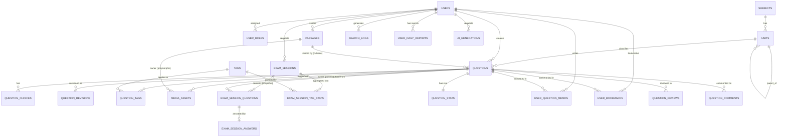

# 낢음 수정 필요!
---

# 출제 스튜디오 (Exam Studio) — DB 스키마 설계안 (최신 고도화 버전)

## 1. 설계 원칙

나중에 기능이 추가돼도 스키마 마이그레이션 없이 버틸 수 있도록 네 가지 원칙을 축으로 잡았습니다.

* **단원은 고정 깊이 컬럼이 아니라 자기참조 트리로 둡니다.** 대단원/중단원/소단원/마이크로단원처럼 깊이가 늘어날 수 있는 구조를 `parent_unit_id` 하나로 표현하면, 나중에 "마이크로단원 아래 세부 유형"이 하나 더 생겨도 컬럼을 추가할 필요가 없습니다.
* **리치 콘텐츠(지문·발문·해설)는 JSON 문서로 저장하고, 미디어는 그 안에서 ID로 참조합니다.** 밑줄, 빈칸 토글, 미디어 그리드(5:5, 4:6 배치) 같은 표현은 관계형 컬럼으로 흩어놓기보다 ProseMirror/Tiptap류의 JSON 노드 트리로 저장하는 게 맞습니다. 그리드 레이아웃(폭 비율, 정렬)은 이 JSON 안의 노드 속성이므로, 나중에 배치 방식이 다양해져도 테이블 구조는 그대로 두고 프론트엔드 렌더러만 확장하면 됩니다.
* **필터 조건과 부가 속성은 JSONB로 열어둡니다.** 소비자가 고르는 필터(과목/단원/난이도/태그…)는 종류가 계속 늘어날 걸로 예상되므로, 모의고사 요청을 저장할 때 조건 자체를 JSONB로 스냅샷 떠서 저장합니다. 문제의 부가 메타데이터(출처, 연도, 배점 정책 등)도 `metadata JSONB`로 열어두면 새 속성이 생겨도 컬럼 추가 없이 대응됩니다.
* **[개선] 강력한 보안 정책 및 데이터 독립성을 보장합니다.** 고유 ID는 외부 노출 시 유추가 불가능하고 분산 환경에서 충돌이 없는 `UUID v4 (CHAR(36))`로 통일합니다. 회원 비밀번호는 레인보우 테이블 및 무차별 대입 공격을 방어하기 위해 단방향 암호화 알고리즘인 `Bcrypt` 또는 `Argon2id` 해시 연산을 의무화합니다. 유저의 학습 행동 데이터(드래그 메모, 검색어, 힌트 확인)는 독립 엔티티로 격리하여 통계 가치를 극대화합니다.

## 2. ERD

---

## 3. 테이블 정의

### 3.1 `users` — 사용자

| 필드 | 타입 | 설명 |
| --- | --- | --- |
| id | CHAR(36) PK | UUID v4 표준 규격 고유 ID |
| email | string, unique |  |
| password_hash | string | Bcrypt 또는 Argon2id 알고리즘으로 안전하게 해시화된 값 (평문 저장 금지) |
| nickname | string |  |
| creator_bio | text, nullable | 크리에이터 이코노미용 프로필 |
| status | enum(ACTIVE, SLEEP, BANNED) | 회원 상태 (활성, 휴면, 정지) |
| last_login_at | timestamp, nullable | 휴면 계정 판단용 |
| created_at / updated_at | timestamp |  |

### 3.1.1 `user_roles` — 사용자 권한 (M:N 매핑 테이블 분리)

한 사람이 출제자(Creator)이면서 동시에 소비자(Consumer)일 수 있는 크리에이터 이코노미 환경을 완벽히 지원하기 위해 매핑 테이블로 분리합니다.

| 필드 | 타입 | 설명 |
| --- | --- | --- |
| user_id | CHAR(36) PK, FK | `users.id` 참조 (ON DELETE CASCADE) |
| role | VARCHAR(50) PK | `CREATOR`, `CONSUMER`, `ADMIN` 등 권한 코드 |

### 3.2 `subjects` — 과목

| 필드 | 타입 | 설명 |
| --- | --- | --- |
| id | CHAR(36) PK | UUID v4 |
| name | string | 예: 행정법, 국어 |
| exam_category | string | 공시/수능/기타 — 대분류 확장성 확보 |
| sort_order | int |  |
| is_active | bool |  |

### 3.3 `units` — 단원 (자기참조 트리)

| 필드 | 타입 | 설명 |
| --- | --- | --- |
| id | CHAR(36) PK | UUID v4 |
| subject_id | FK → subjects |  |
| parent_unit_id | FK → units, nullable | 루트 단원은 null |
| name | string | 예: "부관", "행정행위의 부관" |
| path | string | 조상 경로 캐싱 (`01.03.02`), Breadcrumb용 |
| depth | int | 0=대단원, 조회 편의용 캐시 필드 |
| is_leaf | bool | 리프 단원(마이크로단원)만 문제에 실제 태깅 |
| sort_order | int |  |

### 3.4 `tags` — 교차 분류 태그

| 필드 | 타입 | 설명 |
| --- | --- | --- |
| id | CHAR(36) PK | UUID v4 |
| name | string, unique | 예: "판례", "조문", "함정유형-이중부정" |
| category | string | unit_related / concept / skill / weakness 등 |

### 3.5 `passages` — 지문 (세트형 문항 지원 독립 엔티티)

| 필드 | 타입 | 설명 |
| --- | --- | --- |
| id | CHAR(36) PK | UUID v4 |
| creator_id | FK → users |  |
| content | JSON | 리치텍스트 문서 (ProseMirror/Tiptap 구조 트리) |
| status | enum(DRAFT, PUBLISHED, ARCHIVED) |  |
| deleted_at | timestamp, nullable | 소프트 딜리트 안전장치 |
| created_at / updated_at | timestamp |  |

### 3.6 `questions` — 문제 (힌트 및 인기순 캐시 통합)

| 필드 | 타입 | 설명 |
| --- | --- | --- |
| id | CHAR(36) PK | UUID v4 |
| creator_id | FK → users |  |
| primary_unit_id | FK → units | 마이크로 단원 태깅 |
| passage_id | FK → passages, nullable | 세트형 지문 연결, 단독형은 null |
| question_type | VARCHAR(30) | SINGLE_CHOICE, MULTI_CHOICE, OX, SHORT_ANSWER 등 |
| stem | JSON | 발문(질문) 리치텍스트 |
| explanation | JSON | 정답 해설 리치텍스트 |
| difficulty | VARCHAR(20) | 출제자가 지정한 객관적 난이도 (상, 중, 하) |
| points | numeric | 배점 |
| correct_answer_text | text, nullable | 주관식/서술형용 정답 텍스트 |
| **hint_content** | **TEXT, nullable** | **[신규] 출제자가 제공하는 문제 풀이용 힌트** |
| **view_count** | **INT** | **[신규] 인기순 정렬 성능 최적화를 위한 누적 조회수 캐시 (기본값: 0)** |
| status | enum(DRAFT, IN_REVIEW, PUBLISHED, ARCHIVED) |  |
| metadata | JSON | 출처, 기출연도 등 확장형 메타데이터 |
| version | int | 최신 버전 번호 |
| autosaved_at | timestamp, nullable | 백엔드 자동저장 시각 |
| published_at / deleted_at | timestamp, nullable | 소프트 딜리트 포함 |
| created_at / updated_at | timestamp |  |

*(※ 3.6.1 절의 `stem`/`content` JSON 내부 구조 사양은 동일하게 유지됩니다.)*

### 3.7 `question_choices` — 객관식 선택지

| 필드 | 타입 | 설명 |
| --- | --- | --- |
| id | CHAR(36) PK | UUID v4 |
| question_id | FK → questions |  |
| choice_order | int |  |
| content | JSON | 선택지 리치텍스트 |
| is_correct | bool | 복수정답 지원용 플래그 |

### 3.8 `media_assets` — 미디어 (이미지/그래프)

| 필드 | 타입 | 설명 |
| --- | --- | --- |
| id | CHAR(36) PK | UUID v4 |
| owner_type | enum(PASSAGE, QUESTION, CHOICE) | 폴리모픽 참조 |
| owner_id | CHAR(36) | 가리키는 대상 테이블의 PK |
| uploader_id | FK → users |  |
| asset_type | enum(IMAGE, GRAPH_CODE, SVG) |  |
| storage_url | string |  |
| source_code | text, nullable | AI 그래프 재생성용 원본 코드 |
| width_px / height_px | int |  |
| created_at | timestamp |  |

### 3.9 `question_tags` — 문제-태그 매핑 (M:N)

| 필드 | 타입 |
| --- | --- |
| question_id | FK → questions |
| tag_id | FK → tags |

### 3.10 `question_revisions` — 버전 이력 / 자동저장 스냅샷

| 필드 | 타입 | 설명 |
| --- | --- | --- |
| id | CHAR(36) PK | UUID v4 |
| question_id | FK → questions |  |
| revision_number | int |  |
| snapshot | JSON | 해당 시점의 문제 전체 상태 스냅샷 |
| save_type | enum(AUTOSAVE, MANUAL, PUBLISH) |  |
| created_at | timestamp |  |

### 3.11 `exam_sessions` — 소비자가 조립한 모의고사 (시험지)

| 필드 | 타입 | 설명 |
| --- | --- | --- |
| id | CHAR(36) PK | UUID v4 |
| user_id | FK → users |  |
| subject_id | FK → subjects |  |
| filter_criteria | JSON | 조립 시점 필터 조건 스냅샷 (`unit_ids`, `difficulty` 등) |
| status | enum(IN_PROGRESS, SUBMITTED, EXPIRED) |  |
| started_at / submitted_at | timestamp |  |
| duration_sec | int |  |

### 3.12 `exam_session_questions` — 조립된 문제 스냅샷 (힌트 트래킹 통합)

| 필드 | 타입 | 설명 |
| --- | --- | --- |
| id | CHAR(36) PK | UUID v4 |
| exam_session_id | FK → exam_sessions |  |
| question_id | FK → questions |  |
| display_order | int | 사용자에게 노출되는 문제 순서 (인덱스 적용) |
| **is_hint_used** | **BOOLEAN** | **[신규] 해당 문제를 풀 때 유저가 힌트를 열람했는지 여부 (Default: False)** |
| **hint_used_at** | **TIMESTAMP, nullable** | **[신규] 힌트를 최초로 열람한 시각** |
| snapshot | JSON | 응시 무결성을 위해 출제 당시 원본 문제 내용을 그대로 고정 |

### 3.13 `exam_session_answers` — 사용자 답안 및 채점

| 필드 | 타입 | 설명 |
| --- | --- | --- |
| id | CHAR(36) PK | UUID v4 |
| exam_session_question_id | FK → exam_session_questions |  |
| selected_choice_ids | JSON, nullable | 객관식 선택 ID 목록 |
| answer_text | text, nullable | 주관식 작성 정답 |
| is_correct | bool | 채점 결과 -> 오답노트 필터링의 핵심 기준점 |
| time_spent_sec | int | 풀이 소요 시간 (초) |
| answered_at | timestamp |  |

### 3.14 `exam_session_tag_stats` — 취약점 리포트 캐시

| 필드 | 타입 | 설명 |
| --- | --- | --- |
| exam_session_id | FK → exam_sessions |  |
| tag_id | FK → tags |  |
| total_count | int |  |
| correct_count | int |  |
| accuracy_rate | numeric | 리포트 조회 성능 향상을 위한 사전 집계 캐시 |

### 3.15 `question_stats` — 문항별 통계

| 필드 | 타입 | 설명 |
| --- | --- | --- |
| question_id | PK, FK → questions | 1:1 관계 |
| total_attempts | int | 총 풀이 시도 횟수 |
| correct_attempts | int | 정답 맞춤 횟수 |
| correct_rate | float | 정답률 캐시 필드 |

### 3.16 `user_question_memos` — [구조 정상화/고도화] 드래그 기반 오답노트 코멘트

틀린 문항에 무의미한 통텍스트를 달던 구조를 전면 개편했습니다. 사용자가 지문, 발문, 보기, 해설의 **특정 텍스트 영역을 드래그하여 형광펜 하이라이트를 치고 핀포인트 댓글(주석)을 남길 수 있는** 차세대 학습 기능입니다.

| 필드 | 타입 | 설명 |
| --- | --- | --- |
| id | CHAR(36) PK | UUID v4 |
| user_id | FK → users | 작성자 ID (ON DELETE CASCADE) |
| question_id | FK → questions | 대상 문항 ID (ON DELETE CASCADE) |
| error_reason_code | VARCHAR(20), null | 오답 분석 통계용 태그 코드 (`CONCEPT`: 개념부족, `MISTAKE`: 실수, `TIME`: 시간부족 등) |
| target_type | VARCHAR(20) | 드래그 대상 구역 (`PASSAGE`: 지문, `STEM`: 발문, `CHOICES`: 보기, `EXPLANATION`: 해설) |
| target_id | CHAR(36), null | 특히 지문 테이블(`passages.id`) 등 특정 엔티티 조인용 앵커 ID |
| selected_text | TEXT | 유저가 마우스/터치로 긁어 박제한 화면상의 원본 문구 문자열 |
| selection_range | JSON | 웹 에디터 내 정밀 오프셋 위치 정보 (예: `{"start_offset": 12, "end_offset": 28}`) |
| memo_text | TEXT | 드래그한 문구에 사용자가 직접 남긴 오답 메모/주석 내용 |
| highlight_color | VARCHAR(20) | 형광펜 UI 렌더링 색상 (기본값: 'yellow') |
| created_at / updated_at | timestamp | 한 문제 내 다중 메모 작성을 위해 UNIQUE 제약 해제 |

### 3.17 `user_bookmarks` — 사용자 문항 스크랩 (찜)

| 필드 | 타입 | 설명 |
| --- | --- | --- |
| user_id | PK, FK → users |  |
| question_id | PK, FK → questions |  |
| created_at | timestamp |  |

### 3.18 `user_daily_reports` — 일일 잔디(스트릭) 학습 통계

| 필드 | 타입 | 설명 |
| --- | --- | --- |
| id | CHAR(36) PK | UUID v4 |
| user_id | FK → users |  |
| date | date | 연-월-일 (user_id와 결합 UNIQUE) |
| solved_count | int | 하루 풀이 문항 수 |
| correct_count | int | 하루 맞춘 문항 수 |
| total_study_sec | int | 총 학습 소요 시간 |

### 3.19 `ai_generations` — AI 생성 이력

| 필드 | 타입 | 설명 |
| --- | --- | --- |
| id | CHAR(36) PK | UUID v4 |
| creator_id | FK → users |  |
| subject_id | FK → subjects, nullable |  |
| unit_id | FK → units, nullable |  |
| input_params | JSON |  |
| model | string |  |
| status | enum(PENDING, COMPLETED, FAILED) |  |
| created_at | timestamp |  |

### 3.20 `question_reviews` — 문제 리뷰 및 주관적 난이도 평가 (평가 이원화)

단순한 1~5점 별점 구성을 넘어, 문제의 완성도(추천)와 수험생 체감 난이도를 철저히 이원화하여 통계 신뢰도를 크게 높였습니다.

| 필드 | 타입 | 설명 |
| --- | --- | --- |
| id | CHAR(36) PK | UUID v4 |
| user_id | FK → users | 평가 작성자 ID (한 유저는 문제당 1개만 생성 가능 - UNIQUE) |
| question_id | FK → questions | 대상 문항 ID |
| rating | INT | 문제의 품질 및 구성 추천도 (1~5점 점수제) |
| **perceived_difficulty** | **INT** | **[신규] 수험생이 직접 몸으로 느낀 주관적 난이도 (1: 최하 ~ 5: 최상)** |
| review_text | text, nullable | 주관평 코멘트 |
| created_at | timestamp |  |

### 3.21 `question_comments` — 문제 커뮤니티 (Q&A 스레드)

| 필드 | 타입 | 설명 |
| --- | --- | --- |
| id | CHAR(36) PK | UUID v4 |
| question_id | FK → questions | 대상 문항 |
| parent_comment_id | FK → question_comments | 대댓글 구현을 위한 자기참조 트리 구조 (루트는 NULL) |
| user_id | FK → users | 작성자 |
| content | text | 내용 |
| created_at | timestamp |  |

### 3.22 `search_logs` — [신규 추가] 인기 검색어 통계용 로그

메인 화면 및 검색 창에 "실시간/기간별 인기 검색 키워드 Top 10" 리스트를 정교하게 큐레이션하기 위해 사용자의 검색 이력을 실시간 스냅샷으로 저장합니다.

| 필드 | 타입 | 설명 |
| --- | --- | --- |
| id | CHAR(36) PK | UUID v4 |
| user_id | CHAR(36), null | 로그인 사용자의 경우 추적용 매핑 (비회원 검색 허용을 위해 NULL 허용) |
| keyword | VARCHAR(255) | 사용자가 실제로 입력하여 검색한 키워드 텍스트 (인덱스 적용) |
| created_at | TIMESTAMP | 검색이 발생한 시각 |

---

## 4. 확장 시나리오 체크

* **인기 콘텐츠 정렬 및 트렌드 분석 기능이 추가된다면** ➡️ `questions.view_count` 컬럼 캐시와 신설된 `search_logs` 테이블 덕분에 조인 부하 없이 기간별 인기 검색어 랭킹 리포트와 인기 큐레이션 풀을 즉시 구성할 수 있습니다.
* **오답노트 기반의 취약점 AI 피드백을 강화한다면** ➡️ 고도화된 오답노트 스키마(`user_question_memos`)의 `error_reason_code`와 `target_type`을 기반으로 통계 분석을 돌려 "OO님은 지문 문항에서 '개념부족'으로 문구를 오해하여 하이라이트한 비중이 70%로 매우 높습니다"와 같은 차세대 맞춤형 분석을 테이블 마이그레이션 없이 추출해 낼 수 있습니다.
* **힌트 패널티나 모드 전환 정책이 생긴다면** ➡️ 응시 스냅샷 테이블(`exam_session_questions`)에 이미 `is_hint_used` 유무와 로그 시간이 안전하게 기록되므로, 백엔드의 채점/감점 비즈니스 로직만 고도화하면 유연하게 수용됩니다.
* **미디어 다중 배치 방식이 늘어난다면** / **필터 조건이 늘어난다면** ➡️ 기존 설계 기조에 부합하게 JSON 레이아웃 구조 확장 및 JSONB 메타데이터 인덱싱 연동만으로 완벽하게 대응 가능합니다.